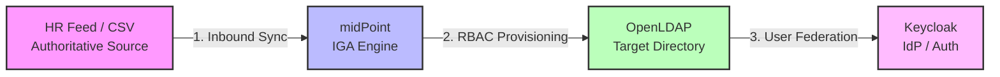

# Identity Governance Lab

> A fully open-source Identity Governance and Administration (IGA) environment
> demonstrating the enterprise identity lifecycle end to end: authoritative-source
> ingestion, role-based provisioning, joiner-mover-leaver automation, orphaned-account
> reconciliation, and single sign-on federation.

---

## Overview

Identity governance is the discipline of making sure the right people have the
right access, and only that access, across their entire time in an organization.
Enterprises pay heavily for platforms like SailPoint to do this. This project
reproduces the same core patterns using only open-source tooling, to demonstrate
the underlying concepts rather than reliance on any single vendor.

The lab models the full govern-provision-authenticate chain. A CSV file stands in
for an HR system as the authoritative source of identities. midPoint governs those
identities and provisions accounts based on roles. OpenLDAP is the target
directory. Keycloak federates that directory so provisioned users can sign in. The
result is a working, self-hosted IGA pipeline running in Docker on a single host.

## Architecture

| Component | Role |
|-----------|------|
| CSV feed | HR authoritative source of identities |
| midPoint | IGA engine: inbound sync, RBAC, provisioning, reconciliation |
| OpenLDAP | Target directory that receives provisioned accounts |
| Keycloak | Identity provider federating the directory for SSO |
| phpLDAPadmin | Directory inspection and verification |

All five services run as containers on one Ubuntu VM via Docker Compose.

## Capabilities Demonstrated

**Authoritative-source ingestion.** Identities are imported from the HR feed with
attribute mappings, so midPoint becomes the system of record rather than each
target managing its own users.

**Role-based provisioning (RBAC).** Access to the directory is granted through
roles, not by hand, so entitlements are consistent and auditable.

**Joiner-Mover-Leaver lifecycle.** A new row provisions an account, an attribute
change flows through to the directory, and a deactivation cascades to disable the
downstream account. This is the day-to-day work of an IAM team, automated.

**Reconciliation and orphaned-account detection.** A rogue account created directly
in the directory is detected by midPoint as an unmatched, unauthorized entry and
remediated. This is the governance control that catches access no one approved.

**SSO federation.** Keycloak federates the provisioned directory, closing the loop
from HR record to working login.

## Screenshots

| Stage | Evidence |
|-------|----------|
| Imported identities | The HR feed is ingested by midPoint and each record becomes a governed user with its attributes mapped from the source.      Given name, family name, title, and organizational unit are populated directly
from the CSV, and the account is linked (Accounts: 1).|
| Provisioned to directory | `./screenshots/04-ldap-account.png` |
| Joiner / Mover / Leaver | `./screenshots/05-jml-lifecycle.png` |
| Reconciliation (orphan detected) | `./screenshots/08-reconciliation.png` |
| Keycloak federation and login | `./screenshots/09-keycloak-sso.png` |

<!-- Replace the paths above with embedded images once captured, e.g.:
 -->

## Skills Demonstrated

- Identity Governance and Administration (IGA) concepts and workflow
- Identity lifecycle automation (joiner, mover, leaver)
- Role-based access control design
- Directory services (LDAP schema, object classes, bind and search)
- Account reconciliation and orphaned-access detection
- Federation and single sign-on with an identity provider
- Containerized deployment with Docker Compose and Infrastructure-as-Code practices

These map directly to the identity governance and access-management domains of the
Microsoft SC-300 (Identity and Access Administrator) certification.

## Tech Stack

Ubuntu Server, Docker and Docker Compose, midPoint, OpenLDAP, phpLDAPadmin,
Keycloak.

## How It Works

The pipeline runs as five containers on a single host, orchestrated with Docker Compose.

Identities originate in a CSV file that stands in for an HR system. midPoint imports those records through the CSV connector, mapping source fields to identity attributes so it becomes the system of record. Access to the target directory is granted through roles rather than by hand, so assigning a role to a user triggers midPoint to construct and provision the matching LDAP account automatically.

From there the lifecycle runs on its own. A new record provisions an account, an attribute change flows through to the directory, and a deactivation cascades to disable the downstream account, covering the full joiner, mover, and leaver cycle. midPoint then reconciles against the directory on a schedule: any account that exists in LDAP without a matching owner is flagged as unauthorized and remediated, which is the governance control that catches orphaned access.

Finally, Keycloak federates the OpenLDAP directory as an identity provider, so a user who was provisioned from the original HR record can authenticate through single sign-on. That closes the loop from source record to working login.

## What I Learned

A few things this build taught me beyond the happy path: the target directory does
not create organizational units for you, so provisioning fails until the structure
is seeded first; bootstrap configuration only applies to a fresh data volume, which
matters when iterating; and mounting the HR feed as a volume rather than copying it
turns the lifecycle demo into a clean edit-and-reimport loop. Working through these
is the operational side of identity work, not just the theory.

## Roadmap

- Access-review and certification exports
- Over-privilege reporting against a least-privilege baseline
- A written governance report summarizing findings

## About

Built by Jeffrey Lam-Ping-Fong, a fourth-year Honours Bachelor of Information
Technology student specializing in cybersecurity, with a focus on identity and
access management.

- LinkedIn: https://www.linkedin.com/in/jeffrey-lam-ping-fong-07a649321
