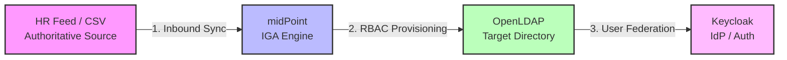
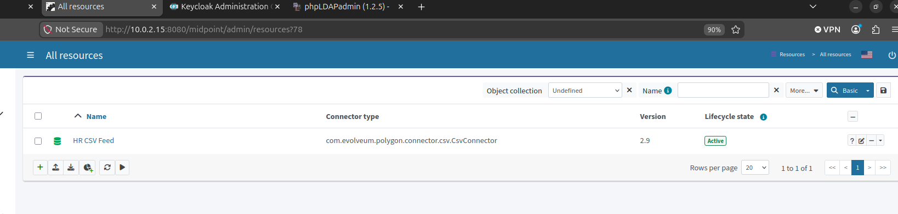
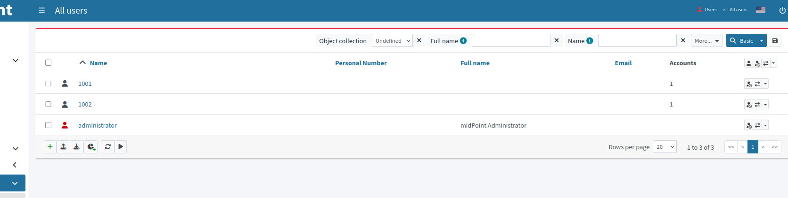
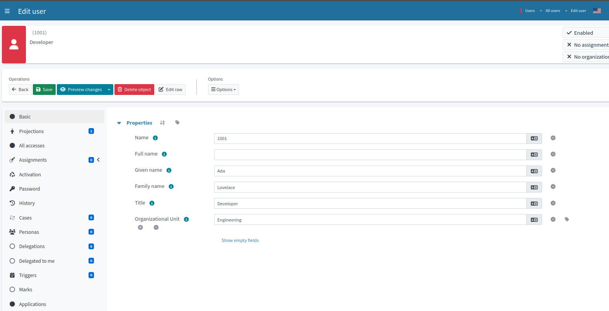

# Identity Governance Lab

> A fully open-source Identity Governance and Administration (IGA) environment
> demonstrating the enterprise identity lifecycle end to end: authoritative-source
> ingestion, role-based provisioning, joiner-mover-leaver automation,
> orphaned-account reconciliation, single sign-on federation, and access review.

---

## Overview

Identity governance is the discipline of making sure the right people have the
right access, and only that access, across their entire time in an organization.
Enterprises pay heavily for platforms like SailPoint to do this. This project
reproduces the same core patterns using only open-source tooling, to demonstrate
the underlying concepts rather than reliance on any single vendor.

The lab models the full govern-provision-authenticate chain. A CSV file stands in
for an HR system as the authoritative source of identities. midPoint governs those
identities and provisions accounts based on roles. OpenLDAP is the target
directory. Keycloak federates that directory so provisioned users can sign in. The
result is a working, self-hosted IGA pipeline running in Docker on a single host.

## Architecture

## Scale and Automation

This lab runs a deliberately small dataset, but nothing about the design depends on
that. The number of identities is a configuration detail, not an architectural one:
the same connector, mappings, roles, and reconciliation tasks that govern a handful
of users govern tens of thousands without changing shape, because every decision is
driven by the authoritative source and by roles rather than by manual action.
Ingestion is automated end to end. Records are pulled from the source, provisioning
fires from role assignment, and reconciliation runs as a scheduled task rather than
a one-off, so access is governed continuously rather than at a single point in time.
In a real deployment the CSV is simply swapped for a live HR feed or directory, and
the rest of the pipeline is unchanged. The point of the lab is the model, and the
model is the one that scales.

---

| Component | Role |
|-----------|------|
| CSV feed | HR authoritative source of identities |
| midPoint | IGA engine: inbound sync, RBAC, provisioning, reconciliation, review |
| OpenLDAP | Target directory that receives provisioned accounts |
| Keycloak | Identity provider federating the directory for SSO |
| phpLDAPadmin | Directory inspection and verification |

All services run as containers on one Ubuntu host via Docker Compose.

---

## Governance Controls Demonstrated

Organizations struggle to answer three questions with confidence: who has access
to what, why they have it, and whether they still should. When provisioning is
manual, the result is predictable: accounts left behind when people leave, users
accumulating entitlements they no longer need, and offboarding that lags days
behind someone's last day. Each stage below pairs the evidence with the control it
represents and the real-world failure it prevents.

### 1. Authoritative source to governed identities

The HR feed is ingested by midPoint, and each record becomes a governed user with
its attributes mapped from the source.

**Why it matters:** An authoritative source establishes a single system of record,
so every downstream access decision traces back to one trustworthy origin rather
than each application inventing and managing its own accounts. This is the
foundation the rest of governance depends on: you can only review, reconcile, or
revoke access once there is a definitive answer to "who is this person and where
does that truth live."

Given name, family name, title, and organizational unit are populated directly
from the CSV, and the account is linked (Accounts: 1).

### 2. Role-based provisioning to the directory

Access to the target directory is granted by assigning a role, which triggers
midPoint to construct and provision the matching account automatically, rather
than an administrator creating it by hand.

**Why it matters:** Granting access through roles is the principle of least
privilege in practice. Every entitlement is attributable to a role, which makes it
explainable, reviewable, and revocable. Directly created accounts produce access
that nobody can justify later; role-based provisioning produces access that always
carries a reason. It is also the foundation for segregation of duties, since
conflicting roles can be defined and blocked before they are ever granted.

The account appears in the directory only because a role was assigned in midPoint,
not because it was created manually.

### 3. Joiner, Mover, Leaver lifecycle

A new record provisions an account, an attribute change flows through to the
directory, and a deactivation cascades to disable the downstream account.

**Why it matters:** The leaver step is the one that matters most for security.
Automated deprovisioning closes the window in which a departed employee keeps
working access, which is one of the most common and most damaging findings in real
access audits. Manual offboarding is slow and easy to forget; tying deactivation
to the authoritative source means access ends when employment ends, not days later
when someone happens to remember.

One change at the source (a new row, a changed department, a deactivation)
propagates automatically to the account's real state.

### 4. Reconciliation and orphaned-account detection

An account is created directly in the directory, bypassing midPoint entirely, to
simulate an unauthorized or leftover account. Reconciliation detects it as
unmatched and flags it for remediation.

**Why it matters:** This is the control with no equivalent in basic account
management, and the clearest proof of governance. An orphaned or rogue account is
standing access that no authoritative source ever approved: created out of band,
left behind after a departure, or never cleaned up. It is a classic persistence
and privilege-escalation path for an attacker and a classic audit failure.
Reconciliation catches it by periodically comparing the directory's actual state
against the governed source of truth, so any account without a legitimate owner is
surfaced rather than sitting unnoticed. This is the difference between managing
accounts and governing access.

midPoint identifies the account as having no owner in the source of truth and marks
it for remediation.

### 5. Single sign-on federation

Keycloak federates the provisioned directory as an identity provider, so a user who
was governed and provisioned from the original HR record can authenticate through
single sign-on.

**Why it matters:** Federation separates the governance of identity from the
authentication of it. midPoint decides who should have access and provisions it;
Keycloak consumes that governed directory to broker logins to applications. This is
the modern identity architecture in miniature: one governed source of truth feeds a
central identity provider, so access granted by governance immediately becomes a
usable login, and access revoked by governance immediately stops working.

The login works because the account was provisioned upstream by governance, closing
the loop from HR record to working access.

### 6. Access review and attestation

The governance loop closes here. midPoint runs an access certification campaign that
presents each user's access to a reviewer, who certifies what should remain and
revokes what should not. Any access that fails review is removed automatically when
the campaign closes.

> **Why it matters:** Provisioning grants access; only review proves it is still
> justified. Access reviews answer the auditor's hardest question, "does everyone
> who holds this access still need it," and they are the control that catches
> privilege creep, the slow accumulation of entitlements people keep long after the
> reason for them is gone. Running a real review, with enforced revocation, is what
> separates governing access over time from simply handing it out.

Each user's role assignment became a certification case for the reviewer to decide:

| User | Access reviewed | Decision | Result |
|------|-----------------|----------|--------|
| Ada Lovelace | Engineering role | Accept | Access retained |
| Alan Turing | Security role | Revoke | Access removed on remediation |

The revoked assignment is deprovisioned automatically when the campaign closes, so
the review is an enforced control rather than a paperwork exercise. This is the
capability that lives in dedicated GRC platforms, reproduced here on open-source
tooling.

---

## Key Concepts Demonstrated

This lab exercises the core vocabulary and controls of identity governance: an
**authoritative source** acting as the single **system of record**; the full
**joiner, mover, leaver** lifecycle with automated **provisioning** and
**deprovisioning**; **role-based access control** as the mechanism for enforcing
**least privilege** and enabling **segregation of duties**; **reconciliation** to
detect **orphaned accounts** and unauthorized **entitlements**; and **access review
and attestation** to certify that standing access is still justified. Together these
cover the full governance loop, from establishing identity to granting access to
proving, over time, that the access is still warranted.

## Defensive Value

Identity governance is a defensive control set, and each stage of this pipeline
closes a specific attack path. Orphaned and dormant accounts are among the most
reliable footholds an attacker has, offering persistence and a route for lateral
movement through access nobody is watching; reconciliation removes them by
continuously comparing the directory against the source of truth. Excessive standing
entitlements are what turn a single compromised account into a breach, since
privilege escalation depends on there being privilege to seize; role-based least
privilege and access review keep that surface small and force it to be re-justified
over time. Slow deprovisioning leaves valid credentials in the hands of departed
staff, one of the classic insider and credential-reuse risks; automated
joiner-mover-leaver ends access the moment employment does. And because a single
governed source of truth feeds authentication through federation, revoking access is
immediate and complete rather than leaving a forgotten account alive in some
downstream system. Approaching identity from an offensive background makes the value
concrete: these are the controls that take away the things an attacker reaches for
first.

## Skills Demonstrated

- Identity Governance and Administration (IGA) concepts and workflow
- Identity lifecycle automation (joiner, mover, leaver)
- Role-based access control design
- Directory services (LDAP schema, object classes, bind and search)
- Account reconciliation and orphaned-access detection
- Access review and certification campaigns
- Federation and single sign-on with an identity provider
- Containerized deployment with Docker Compose and Infrastructure-as-Code practices

## Tech Stack

Ubuntu Server, Docker and Docker Compose, midPoint, OpenLDAP, phpLDAPadmin,
Keycloak.

## What I Learned

A few things this build taught me beyond the happy path: the target directory does
not create organizational units for you, so provisioning fails until the structure
is seeded first; bootstrap configuration only applies to a fresh data volume, which
matters when iterating; a named volume mounted over a directory hides bind-mounted
files beneath it, which is why the CSV had to live outside the persistent path; and
an import task reports success but creates nothing unless a synchronization reaction
tells it to. Working through these is the operational side of identity work, not
just the theory.

## Roadmap

- Over-privilege reporting against a least-privilege baseline
- A written governance report summarizing review findings
- Segregation-of-duties policy enforcement

## About

Built by Jeffrey Lam-Ping-Fong, a fourth-year Honours Bachelor of Information
Technology student specializing in cybersecurity, with a focus on identity and
access management.

- LinkedIn: https://www.linkedin.com/in/jeffrey-lam-ping-fong-07a649321
