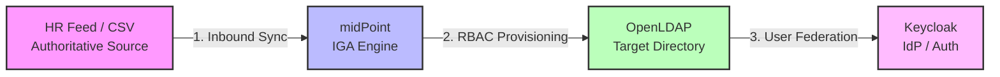

# Open-Source IGA Lab: midPoint + OpenLDAP + Keycloak

An end-to-end identity governance and administration (IGA) lab built entirely
from open-source tooling. A CSV file acts as the HR authoritative source,
midPoint is the IGA engine, OpenLDAP is the target directory, and Keycloak
federates that directory so provisioned users can authenticate. The flow is
**govern, then provision, then authenticate**.



> Note on the diagram: the opening code fence must be labelled ` ```mermaid `
> for GitHub to render it. `<br/>` and the `style` lines are safe. Avoid `<i>`
> tags inside node labels, since GitHub's Mermaid sanitizer can strip them.

---

## Architecture

Everything runs in Docker on a **single Ubuntu VM**. You do not need multiple
machines; the skill being demonstrated is the IGA design and configuration, not
infrastructure sprawl.

| Component | Role | Host port |
|-----------|------|-----------|
| midPoint (+ PostgreSQL) | IGA engine: inbound sync, RBAC, provisioning, reconciliation | 8080 |
| OpenLDAP | Target directory midPoint provisions into | 389 |
| phpLDAPadmin | Visual view of the directory (great for screenshots) | 8082 |
| Keycloak | IdP that federates the directory for SSO | 8081 |
| CSV file | HR authoritative source | (mounted file) |

**VM spec:** Ubuntu Server 24.04 LTS, 8 GB RAM, 4 vCPU, 60 GB disk. midPoint
alone wants around 2 GB, and you are running five containers, so do not
undersize the RAM.

---

## Stage 1: Install Docker

```bash
sudo apt update && sudo apt -y upgrade
curl -fsSL https://get.docker.com | sh
sudo usermod -aG docker $USER
newgrp docker
docker version
```

**[Screenshot 1]** `docker version` output, proving the host is ready.

---

## Stage 2: Get the midPoint Compose file

midPoint's current line is 4.9 / 4.10 and ships an official Compose file, which
is the reliable way to stand it up because recent midPoint needs a real
PostgreSQL behind it.

```bash
mkdir ~/iga-lab && cd ~/iga-lab
curl -O https://raw.githubusercontent.com/Evolveum/midpoint-docker/master/docker-compose.yml
```

Do **not** run `docker compose up` yet. First create the host files that will be
mounted in (Stage 3), otherwise Docker will create empty directories where your
files should be.

---

## Stage 3: Prepare host files and edit the Compose file

### 3a. Create the HR feed (Tweak 2: mount instead of copy)

Mounting the CSV as a volume turns the lab into true Infrastructure-as-Code: you
edit the file on the host and re-run the import, with no re-copying. This pays
off heavily in the JML stage.

```bash
mkdir -p ~/iga-lab/data
cat > ~/iga-lab/data/hr-feed.csv <<'EOF'
empId,firstName,lastName,department,title,status
1001,Ada,Lovelace,Engineering,Developer,active
1002,Alan,Turing,Security,Analyst,active
EOF
```

### 3b. Create the OpenLDAP seed for ou=people (Tweak 1: the OU gotcha)

`osixia/openldap` creates the base `dc=example,dc=org` from `LDAP_DOMAIN`, but it
does **not** create the `ou=people` organizational unit. If you skip this,
midPoint provisioning in Stage 5 fails with a "no such object" error. Seed it:

```bash
mkdir -p ~/iga-lab/ldif
cat > ~/iga-lab/ldif/ou-people.ldif <<'EOF'
dn: ou=people,dc=example,dc=org
objectClass: organizationalUnit
ou: people
EOF
```

> Important: osixia only runs bootstrap LDIFs on a **fresh** data volume at first
> init. If the LDAP container has already started once, the seed will not
> re-fire. Either create `ou=people` by hand in phpLDAPadmin, or wipe and
> recreate early with `docker compose down -v` (this deletes volume data, so only
> do it before you have real state you care about).

### 3c. Add the volume mount to midPoint

Open `docker-compose.yml`. Find the existing `midpoint_server` service and add
this line to its existing `volumes:` list (do not create a second `volumes:`
block):

```yaml
      - ./data/hr-feed.csv:/opt/midpoint/var/hr-feed.csv
```

### 3d. Add OpenLDAP, phpLDAPadmin, and Keycloak

Add these three services under the existing `services:` block, matching its
indentation. Being in the same file means they share midPoint's network and
resolve each other by name.

```yaml
  openldap:
    image: osixia/openldap:1.5.0
    container_name: openldap
    environment:
      LDAP_ORGANISATION: "IGA Lab"
      LDAP_DOMAIN: "example.org"
      LDAP_ADMIN_PASSWORD: "adminpassword"
    ports:
      - "389:389"
    volumes:
      - ./ldif/ou-people.ldif:/container/service/slapd/assets/config/bootstrap/ldif/custom/01-ou-people.ldif

  phpldapadmin:
    image: osixia/phpldapadmin:0.9.0
    container_name: phpldapadmin
    environment:
      PHPLDAPADMIN_LDAP_HOSTS: "openldap"
      PHPLDAPADMIN_HTTPS: "false"
    ports:
      - "8082:80"
    depends_on: [openldap]

  keycloak:
    image: quay.io/keycloak/keycloak:26.7.3
    container_name: keycloak
    command: start-dev
    environment:
      KC_BOOTSTRAP_ADMIN_USERNAME: "admin"
      KC_BOOTSTRAP_ADMIN_PASSWORD: "admin"
    ports:
      - "8081:8080"
```

Port split: midPoint keeps 8080, Keycloak is on 8081, phpLDAPadmin on 8082, so
nothing collides. Keycloak 26 uses `KC_BOOTSTRAP_ADMIN_USERNAME` /
`KC_BOOTSTRAP_ADMIN_PASSWORD` (older `KEYCLOAK_ADMIN` guides predate v26). LDAP
base is `dc=example,dc=org`; the LDAP admin is `cn=admin,dc=example,dc=org`.

---

## Stage 4: Bring the stack up

```bash
cd ~/iga-lab
docker compose up -d
docker compose ps
```

Wait about a minute, then open midPoint at `http://<VM-IP>:8080`. Default login
is `administrator` / `5ecr3t`. If that is rejected, check the generated password
with `docker compose logs midpoint_server`.

**[Screenshot 2]** `docker compose ps` showing all five containers up, and the
midPoint dashboard after first login.

---

## Stage 5: CSV authoritative source (the inbound half of IGA)

In the midPoint GUI: **Resources > New resource**, choose the **CSV connector**.
Point it at `/opt/midpoint/var/hr-feed.csv` (the path inside the container from
your mount), set `empId` as the unique attribute, and test the connection. Then
define inbound mappings:

- `empId` to name
- `firstName` to givenName
- `lastName` to familyName
- `department` and `title` carried across

Run an **Import** task on the resource to pull the two rows in as midPoint users.

**[Screenshot 3]** The CSV resource showing a green connection test, and the two
imported users in the user list.

---

## Stage 6: LDAP target and role-based provisioning (the outbound half)

Add a second resource using the **LDAP connector**:

- Host: `openldap`, port `389`
- Bind DN: `cn=admin,dc=example,dc=org`, password `adminpassword`
- Base context: `ou=people,dc=example,dc=org`
- Account object class: `inetOrgPerson`
- Outbound mappings: name to uid, full name to cn, last name to sn

Create a **Role** called "LDAP Account" whose inducement constructs an account on
the LDAP resource. Assign that role to Ada; provisioning fires and she appears in
the directory.

**[Screenshot 4]** Ada's entry in phpLDAPadmin at `http://<VM-IP>:8082`, next to
her midPoint role assignment.

---

## Stage 7: The JML lifecycle (the core resume story)

Because the CSV is a mounted volume, each step is just an edit-and-reimport, no
re-copying.

- **Joiner:** add a new row to `./data/hr-feed.csv`, re-run Import. The new user
  is created, and once the role is assigned, provisioned into LDAP.
- **Mover:** change someone's department or title in the CSV and re-import. The
  attribute change flows through to their LDAP entry.
- **Leaver:** set their `status` to `inactive` (or remove the row) and configure
  the import's sync reaction so that maps to disabling the midPoint user, which
  cascades to disabling the LDAP account.

**[Screenshots 5, 6, 7]** Three before-and-after pairs (one each for Joiner,
Mover, Leaver) showing the LDAP entry created, modified, then disabled.

---

## Stage 8: Reconciliation (the moment that says "governance")

In phpLDAPadmin, manually create a rogue `inetOrgPerson` under `ou=people` that
midPoint does not know about. Then run a **Reconciliation** task on the LDAP
resource. midPoint detects the account has no owner and flags it as an unmatched
situation, which is exactly how real IGA catches orphaned and unauthorized
access. Remediate it (delete or link to an owner).

**[Screenshot 8]** The reconciliation result listing the unmatched account, then
the cleaned state. This is the single most valuable screenshot in the project.

---

## Stage 9: Keycloak federation (the SSO cherry)

Open Keycloak at `http://<VM-IP>:8081` (`admin` / `admin`). Create a realm, go to
**User Federation**, add an **LDAP provider**:

- Connection URL: `ldap://openldap:389`
- Bind DN: `cn=admin,dc=example,dc=org`
- Users DN: `ou=people,dc=example,dc=org`

Sync users. Your midPoint-provisioned accounts now exist in Keycloak and can
authenticate, closing the govern-provision-authenticate loop.

**[Screenshot 9]** The federated users listed in Keycloak, and one successful
login.

---

## Common friction points

- **midPoint default password** rejected: check `docker compose logs midpoint_server`.
- **ou=people missing** at Stage 6: the seed LDIF only fires on a fresh volume;
  create the OU manually or `docker compose down -v` and start clean.
- **Port collisions**: confirm the 8080 / 8081 / 8082 split held after your edits.
- **LDAP outbound mappings**: the most fiddly part; get uid/cn/sn mapped exactly.
- **Mounted CSV shows as a directory**: the host file must exist before
  `docker compose up`, or Docker creates a directory in its place.

Keep notes on what broke and how you fixed it. "Here is what I debugged" is a
strong addition to the write-up and shows real operational skill.

---

## Next (reporting layer, later)

Once the build is solid: add access-review exports, an over-privilege report
against a least-privilege baseline, and a short architecture write-up. These turn
the lab from "I stood up tools" into "I governed identities and can show it."
